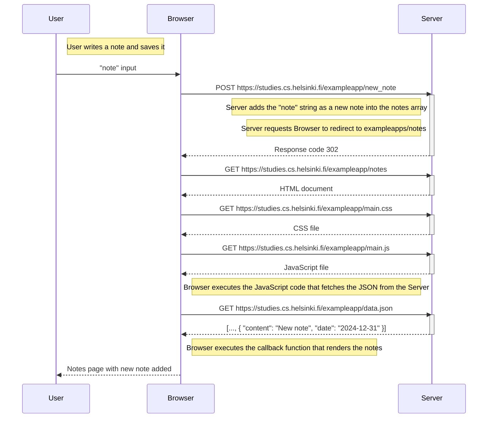

```mermaid
sequenceDiagram
    participant User
    participant Browser
    participant Server

    Note right of User: User writes a note and saves it
    User->>Browser: "note" input

    Browser->>Server: POST https://studies.cs.helsinki.fi/exampleapp/new_note
    activate Server
    Note left of Server: Server adds the "note" string as a new note into the notes array
    Note left of Server: Server requests Browser to redirect to exampleapps/notes
    Server-->>Browser: Response code 302
    deactivate Server

    Browser->>Server: GET https://studies.cs.helsinki.fi/exampleapp/notes
    activate Server
    Server-->>Browser: HTML document
    deactivate Server

    Browser->>Server: GET https://studies.cs.helsinki.fi/exampleapp/main.css
    activate Server
    Server-->>Browser: CSS file
    deactivate Server
    
    Browser->>Server: GET https://studies.cs.helsinki.fi/exampleapp/main.js
    activate Server
    Server-->>Browser: JavaScript file
    deactivate Server
    
    Note right of Browser: Browser executes the JavaScript code that fetches the JSON from the Server
    Browser->>Server: GET https://studies.cs.helsinki.fi/exampleapp/data.json
    activate Server
    Server-->>Browser: [..., { "content": "New note", "date": "2024-12-31" }]
    deactivate Server

    Note right of Browser: Browser executes the callback function that renders the notes

    Browser-->>User: Notes page with new note added

```