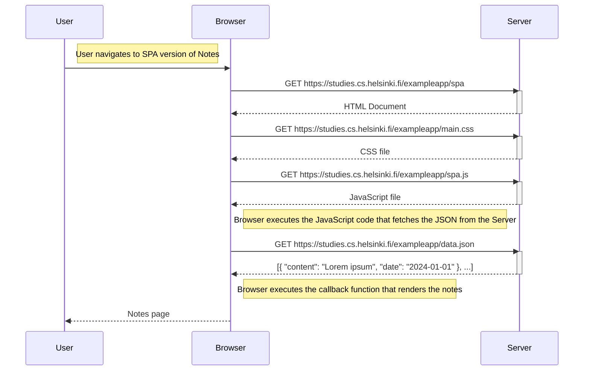

```mermaid
sequenceDiagram
    participant User
    participant Browser
    participant Server

    Note right of User: User navigates to SPA version of Notes
    User->>Browser: 

    Browser->>Server: GET https://studies.cs.helsinki.fi/exampleapp/spa
    activate Server
    Server-->>Browser: HTML Document
    deactivate Server

    Browser->>Server: GET https://studies.cs.helsinki.fi/exampleapp/main.css
    activate Server
    Server-->>Browser: CSS file
    deactivate Server
    
    Browser->>Server: GET https://studies.cs.helsinki.fi/exampleapp/spa.js
    activate Server
    Server-->>Browser: JavaScript file
    deactivate Server
    
    Note right of Browser: Browser executes the JavaScript code that fetches the JSON from the Server
    Browser->>Server: GET https://studies.cs.helsinki.fi/exampleapp/data.json
    activate Server
    Server-->>Browser: [{ "content": "Lorem ipsum", "date": "2024-01-01" }, ...]
    deactivate Server

    Note right of Browser: Browser executes the callback function that renders the notes

    Browser-->>User: Notes page

```