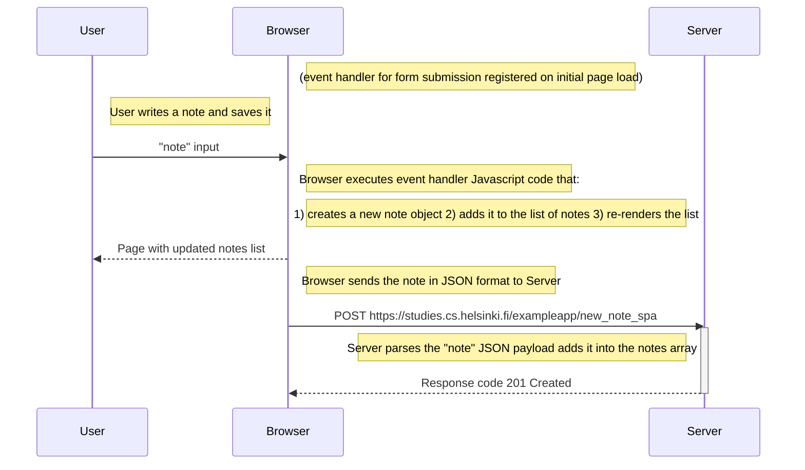

```mermaid
sequenceDiagram
    participant User
    participant Browser
    participant Server

    Note right of Browser: (event handler for form submission registered on initial page load)

    Note right of User: User writes a note and saves it
    User->>Browser: "note" input

    Note right of Browser: Browser executes event handler Javascript code that:
    Note right of Browser: 1) creates a new note object 2) adds it to the list of notes 3) re-renders the list

    Browser-->>User: Page with updated notes list

    Note right of Browser: Browser sends the note in JSON format to Server
    Browser->>Server: POST https://studies.cs.helsinki.fi/exampleapp/new_note_spa
    activate Server
    Note left of Server: Server parses the "note" JSON payload adds it into the notes array
    Server-->>Browser: Response code 201 Created
    deactivate Server
```